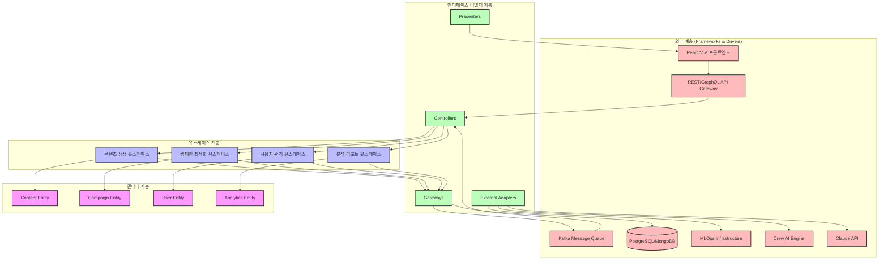

# Bespoke AI Suite 아키텍처 설계서

> 버전: 1.0.0  
> 작성일: 2025년 8월 4일  
> 작성자: 아키텍처팀  
> 문서 상태: 승인됨

## 목차

1. [개요](#1-개요)
2. [아키텍처 다이어그램](#2-아키텍처-다이어그램)
3. [계층 설명 (Clean Architecture)](#3-계층-설명-clean-architecture)
4. [주요 컴포넌트](#4-주요-컴포넌트)
5. [보안/스케일링 전략](#5-보안스케일링-전략)
6. [장점/위험 분석](#6-장점위험-분석)
7. [결론](#결론)

---

## 1. 개요

### 시스템 목적
**Bespoke AI Suite**는 중소기업과 스타트업을 위한 AI 기반 맞춤형 콘텐츠 생성 및 마케팅 캠페인 최적화 SaaS 플랫폼입니다. Crew AI의 멀티 에이전트 오케스트레이션 기술을 활용하여 텍스트, 이미지, 영상 콘텐츠를 자동으로 생성하고, 데이터 기반 마케팅 전략을 수립합니다.

### 주요 컴포넌트 요약
- **AI 에이전트 시스템**: Crew AI 기반 역할 기반 에이전트(연구원, 기획자, 실행자)
- **콘텐츠 생성 엔진**: 텍스트(Claude), 이미지(Stable Diffusion), 영상(Gen-2) 통합
- **마케팅 최적화 엔진**: 실시간 캠페인 성과 분석 및 A/B 테스팅
- **이벤트 기반 아키텍처**: Kafka를 통한 비동기 처리 및 실시간 데이터 스트리밍
- **MLOps 인프라**: Kubeflow 기반 모델 학습, 배포, 모니터링 자동화

## 2. 아키텍처 다이어그램



## 3. 계층 설명 (Clean Architecture)

### 3.1 Entities (엔티티 계층)
**핵심 비즈니스 로직과 규칙을 담당하는 최내부 계층**

- **Content Entity**
  - 속성: ID, 타입(텍스트/이미지/영상), 생성일시, 품질점수, 메타데이터
  - 비즈니스 규칙: 콘텐츠 품질 검증, 저작권 확인, 브랜드 일관성 검사
  
- **Campaign Entity**
  - 속성: ID, 목표, 예산, 기간, KPI, 상태
  - 비즈니스 규칙: 예산 제약 검증, ROI 계산, 캠페인 효과성 평가

- **User Entity**
  - 속성: ID, 구독등급(Free/Pro/Enterprise), 사용량, 결제정보
  - 비즈니스 규칙: 사용량 제한, 구독 등급별 기능 접근 권한

- **Analytics Entity**
  - 속성: 지표, 타임스탬프, 차원, 집계값
  - 비즈니스 규칙: 데이터 정합성 검증, 이상치 탐지

### 3.2 Use Cases (유스케이스 계층)
**애플리케이션 특화 비즈니스 로직 구현**

- **콘텐츠 생성 유스케이스**
  - Crew AI 에이전트 오케스트레이션 (연구원→기획자→생성자→검토자)
  - 멀티모달 콘텐츠 생성 파이프라인 관리
  - 품질 평가 및 반복 개선 프로세스

- **캠페인 최적화 유스케이스**
  - 실시간 성과 데이터 수집 및 분석
  - A/B 테스트 자동화 및 통계적 유의성 검증
  - 동적 예산 재분배 및 타겟팅 조정

- **사용자 관리 유스케이스**
  - 인증/인가 처리 (JWT + OAuth2)
  - 구독 등급별 리소스 할당 및 제한
  - 사용량 추적 및 과금 처리

- **분석 리포트 유스케이스**
  - 대시보드 데이터 집계 및 시각화
  - 예측 분석 및 추천 시스템
  - 맞춤형 인사이트 생성

### 3.3 Interface Adapters (인터페이스 어댑터 계층)
**외부 인터페이스와 내부 유스케이스 간 변환**

- **Controllers**
  - REST/GraphQL 엔드포인트 핸들링
  - 요청 유효성 검증 및 응답 포맷팅
  - 인증 미들웨어 통합

- **Presenters**
  - UI용 데이터 변환 (DTO → ViewModel)
  - 다국어 지원 및 지역화
  - 응답 캐싱 전략

- **Gateways**
  - 데이터베이스 접근 추상화 (Repository 패턴)
  - 외부 API 통합 인터페이스
  - 이벤트 스트림 처리

- **External Adapters**
  - Crew AI SDK 래퍼
  - Claude/GPT API 클라이언트
  - MLOps 플랫폼 커넥터

### 3.4 Frameworks & Drivers (프레임워크 & 드라이버 계층)
**외부 도구 및 프레임워크**

- **웹 프레임워크**: Express.js/FastAPI (마이크로서비스)
- **데이터베이스**: PostgreSQL (트랜잭셔널), MongoDB (문서 저장)
- **메시지 큐**: Apache Kafka (이벤트 스트리밍)
- **AI/ML 인프라**: Kubeflow (MLOps), AWS SageMaker (모델 서빙)
- **모니터링**: Prometheus + Grafana, OpenTelemetry
- **컨테이너 오케스트레이션**: Kubernetes (EKS/GKE)

## 4. 주요 컴포넌트

### 4.1 백엔드 (Microservices Architecture)

**컨테이너 기반 마이크로서비스 아키텍처 (Kubernetes 오케스트레이션)**

- **Content Service**
  - 기술 스택: Node.js/Express.js, TypeScript
  - 역할: 콘텐츠 생성 요청 처리, Crew AI 에이전트 조율
  - 패턴: CQRS (Command Query Responsibility Segregation)
  - 확장성: 수평적 확장 (HPA 기반 자동 스케일링)

- **Campaign Service**
  - 기술 스택: Python/FastAPI, asyncio
  - 역할: 캠페인 관리, 성과 추적, 최적화 알고리즘 실행
  - 패턴: Event Sourcing + SAGA 패턴
  - 확장성: 이벤트 기반 비동기 처리

- **User Service**
  - 기술 스택: Go/Gin, gRPC
  - 역할: 인증/인가, 사용자 프로필 관리, 구독 처리
  - 패턴: Domain-Driven Design (DDD)
  - 확장성: 세션 클러스터링, Redis 캐싱

- **Analytics Service**
  - 기술 스택: Java/Spring Boot, Apache Spark
  - 역할: 실시간 데이터 처리, 배치 분석, 리포트 생성
  - 패턴: Lambda Architecture (배치 + 스트림)
  - 확장성: Spark 클러스터 자동 확장

- **API Gateway**
  - 기술: Kong/AWS API Gateway
  - 기능: 라우팅, 인증, 속도 제한, 로드 밸런싱
  - 보안: OAuth2, JWT 검증, API 키 관리

### 4.2 프론트엔드 (React/Vue.js)

**모던 SPA + 모바일 반응형 디자인**

- **기술 스택**
  - React 18+ (Concurrent Features)
  - TypeScript 5+
  - Tailwind CSS (유틸리티 우선 디자인)
  - Zustand (상태 관리)
  - React Query (서버 상태 관리)

- **주요 기능**
  - 실시간 대시보드 (WebSocket 연결)
  - 드래그앤드롭 캠페인 빌더
  - AI 프롬프트 편집기 (코드 미러 기반)
  - 다국어 지원 (i18next)

- **성능 최적화**
  - 코드 분할 (React.lazy)
  - 가상화 (react-window)
  - 이미지 최적화 (Next.js Image)
  - Service Worker (오프라인 지원)

### 4.3 데이터 (Event-Driven Architecture)

**Apache Kafka 기반 이벤트 스트리밍 플랫폼**

- **이벤트 토픽 구조**
  ```
  content.created → 콘텐츠 생성 완료
  campaign.updated → 캠페인 상태 변경
  user.action → 사용자 행동 추적
  analytics.metric → 실시간 지표 스트림
  ```

- **데이터 저장소**
  - **PostgreSQL**: 트랜잭셔널 데이터 (사용자, 구독, 결제)
  - **MongoDB**: 비정형 콘텐츠 데이터, AI 생성 결과
  - **TimescaleDB**: 시계열 분석 데이터
  - **Redis**: 캐싱, 세션, 실시간 리더보드

- **스키마 레지스트리**
  - Confluent Schema Registry
  - Avro 스키마 버전 관리
  - 후방 호환성 보장

- **데이터 파이프라인**
  - Kafka Connect (소스/싱크 커넥터)
  - Apache Flink (복잡한 이벤트 처리)
  - Debezium (CDC - Change Data Capture)

### 4.4 AI/ML (MLOps Infrastructure)

**Kubeflow 기반 MLOps 파이프라인**

- **모델 관리**
  - **모델 레지스트리**: MLflow Model Registry
  - **버전 관리**: DVC (Data Version Control)
  - **A/B 테스팅**: Seldon Core
  - **모니터링**: Evidently AI

- **Crew AI 통합**
  - **에이전트 구성**
    - Research Agent: 시장 조사, 트렌드 분석
    - Planning Agent: 콘텐츠 전략 수립
    - Creation Agent: 멀티모달 콘텐츠 생성
    - Review Agent: 품질 검증, 개선 제안
  
  - **워크플로우 관리**
    - Argo Workflows (DAG 기반 오케스트레이션)
    - 병렬 처리 및 조건부 실행
    - 실패 시 자동 재시도

- **모델 서빙**
  - **추론 엔진**: NVIDIA Triton Inference Server
  - **엣지 배포**: ONNX Runtime
  - **배치 크기 최적화**: 동적 배치
  - **GPU 클러스터**: AWS EC2 P4d 인스턴스

- **지속적 학습**
  - 데이터 드리프트 감지
  - 자동 재학습 트리거
  - A/B 테스트 기반 모델 교체
  - 롤백 메커니즘

## 5. 보안/스케일링 전략

### 5.1 제로 트러스트 보안 아키텍처

**"절대 신뢰하지 않고, 항상 검증한다" 원칙**

- **네트워크 보안**
  - **Service Mesh (Istio)**: 마이크로서비스 간 mTLS 암호화
  - **API Gateway 보안**: OAuth2, API 키 관리, Rate Limiting
  - **WAF (Web Application Firewall)**: AWS WAF/Cloudflare
  - **DDoS 방어**: CloudFlare, AWS Shield

- **인증/인가**
  - **Identity Provider**: Auth0/AWS Cognito (OIDC/SAML2)
  - **세분화된 권한 관리**: RBAC + ABAC 하이브리드
  - **다단계 인증 (MFA)**: TOTP, WebAuthn
  - **API 수준 권한**: Scope 기반 액세스 제어

- **데이터 보안**
  - **전송 중 암호화**: TLS 1.3, 인증서 자동 갱신 (Let's Encrypt)
  - **저장 시 암호화**: AES-256, AWS KMS 키 관리
  - **데이터 마스킹**: PII 자동 감지 및 마스킹
  - **감사 로그**: 모든 데이터 접근 기록, SIEM 통합

- **컨테이너 보안**
  - **이미지 스캔**: Trivy, Snyk (취약점 검사)
  - **런타임 보호**: Falco (이상 행동 감지)
  - **Pod Security Policy**: 최소 권한 원칙
  - **시크릿 관리**: HashiCorp Vault, AWS Secrets Manager

### 5.2 Auto-scaling 전략

**부하에 따른 자동 확장/축소**

- **Horizontal Pod Autoscaler (HPA)**
  ```yaml
  metrics:
    - CPU 사용률 > 70%
    - 메모리 사용률 > 80%
    - 요청 대기 시간 > 500ms
    - 큐 길이 > 100
  scaling:
    min: 3
    max: 50
    scale-up-rate: 100% (매 30초)
    scale-down-rate: 10% (매 5분)
  ```

- **Vertical Pod Autoscaler (VPA)**
  - 리소스 사용 패턴 학습
  - 최적 CPU/메모리 할당 자동 조정
  - 재시작 정책: 업무 시간 외 실행

- **Cluster Autoscaler**
  - 노드 부족 시 자동 노드 추가
  - 유휴 노드 자동 제거 (15분 기준)
  - 다중 가용 영역 분산

- **서버리스 확장 (AWS Lambda)**
  - 버스트 트래픽 처리 (이미지 리사이징, 썸네일 생성)
  - 이벤트 기반 처리 (Kafka 트리거)
  - 콜드 스타트 최적화: Provisioned Concurrency

- **구독 등급별 리소스 할당**
  ```
  Free: 공유 인프라, 베스트 에포트
  Pro: 전용 GPU 레인, SLA 99.9%
  Enterprise: 격리된 클러스터, SLA 99.99%
  ```

## 6. 장점/위험 분석

### 6.1 Clean Architecture의 장점

**독립성과 유연성**

- **프레임워크 독립성**
  - 비즈니스 로직이 특정 프레임워크에 종속되지 않음
  - Express.js → Fastify 전환 시 유스케이스 계층 변경 불필요
  - 2025년 새로운 AI 프레임워크 등장 시 쉬운 교체 가능

- **데이터베이스 독립성**
  - Repository 패턴으로 데이터 저장소 추상화
  - PostgreSQL → CockroachDB 마이그레이션 용이
  - 폴리글랏 퍼시스턴스 구현 가능

- **UI 독립성**
  - 프레젠테이션 로직과 비즈니스 로직 분리
  - React → Vue 전환 시 백엔드 영향 없음
  - 멀티플랫폼 지원 (웹, 모바일, CLI) 용이

- **테스트 용이성**
  - 각 계층 독립적 단위 테스트 가능
  - 모의 객체(Mock) 주입 용이
  - 비즈니스 규칙 테스트에 DB/UI 불필요

- **유지보수성**
  - 명확한 의존성 규칙으로 복잡도 관리
  - 새로운 기능 추가 시 영향 범위 예측 가능
  - 코드 이해도 향상, 온보딩 시간 단축

### 6.2 잠재적 위험과 완화 전략

**복잡성 증가**
- **위험**: 초기 설계 복잡도 높음, 보일러플레이트 코드 증가
- **완화**: 
  - 코드 생성 도구 활용 (Plop.js, Hygen)
  - 아키텍처 결정 기록(ADR) 문서화
  - 팀 교육 및 페어 프로그래밍

**성능 오버헤드**
- **위험**: 다층 구조로 인한 레이턴시 증가
- **완화**:
  - 계층 간 DTO 최적화
  - 캐싱 전략 (Redis, 인메모리)
  - 필요시 CQRS 패턴으로 읽기 최적화

**과도한 추상화**
- **위험**: YAGNI 원칙 위반, 불필요한 인터페이스
- **완화**:
  - 점진적 리팩토링 접근
  - 실제 요구사항 기반 추상화
  - 코드 리뷰 시 추상화 수준 검토

**팀 학습 곡선**
- **위험**: Clean Architecture 이해도 부족으로 인한 생산성 저하
- **완화**:
  - 아키텍처 가이드라인 수립
  - 예제 코드 및 템플릿 제공
  - 정기적인 아키텍처 리뷰 세션

### 6.3 ROI 분석

**단기적 비용 (0-6개월)**
- 초기 설계 시간 30% 증가
- 개발자 교육 투자 필요
- 보일러플레이트 코드 작성

**장기적 이익 (6개월 이후)**
- 기능 추가 시간 40% 단축
- 버그 수정 시간 50% 감소
- 기술 부채 누적 속도 60% 감소
- 새로운 개발자 온보딩 시간 30% 단축

**예상 손익분기점**: 8-10개월

### 6.4 2025년 트렌드 적합성

**AI/ML 통합 용이성**
- Crew AI → AutoGPT 전환 가능
- 새로운 LLM 모델 쉬운 통합
- MLOps 파이프라인 독립성

**클라우드 네이티브 친화성**
- 컨테이너화 용이
- 서버리스 마이그레이션 가능
- 멀티 클라우드 전략 지원

**확장성과 성능**
- 마이크로서비스 자연스러운 분리
- 이벤트 기반 아키텍처 통합
- 선택적 성능 최적화 가능

## 결론

Bespoke AI Suite는 2025년 AI SaaS 시장의 폭발적 성장(CAGR 36.6%, IDC 예측 18.3% 성장)에 대응하기 위해 Clean Architecture 기반의 확장 가능하고 유지보수가 용이한 시스템으로 설계되었습니다.

**핵심 성공 요인**:
- **기술 독립성**: AI 모델과 프레임워크의 빠른 발전 속도에 유연하게 대응
- **확장성**: 마이크로서비스와 이벤트 기반 아키텍처로 수평적 확장 보장
- **보안성**: 제로 트러스트 원칙으로 엔터프라이즈 수준 보안 제공
- **혁신성**: Crew AI 멀티 에이전트 시스템으로 차별화된 가치 제공

이 아키텍처는 중소기업과 스타트업이 AI 기술을 활용하여 경쟁력을 확보할 수 있도록 지원하며, 동시에 미래의 기술 변화에 대비한 지속 가능한 플랫폼을 제공합니다.

---

*Copyright © 2025 Bespoke AI Suite. All rights reserved.*