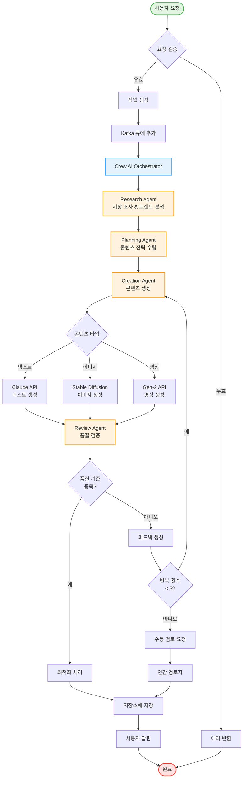
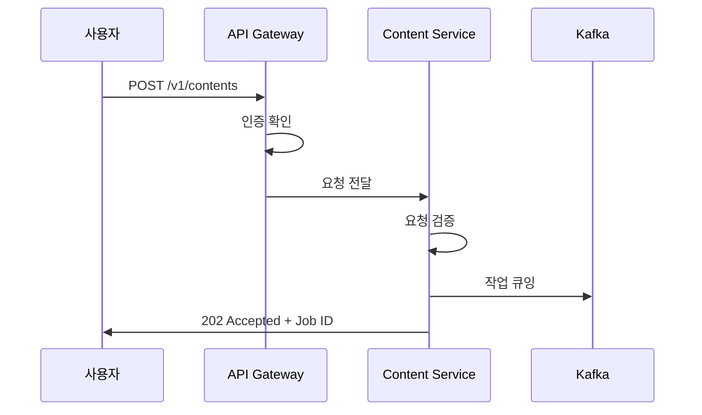
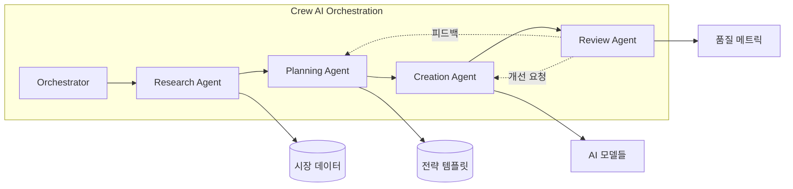
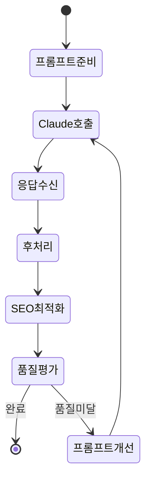
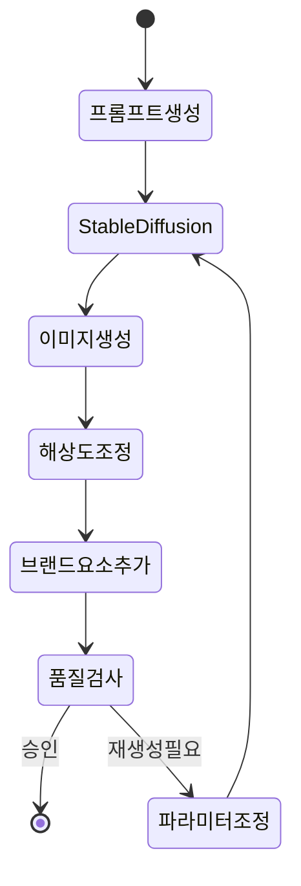
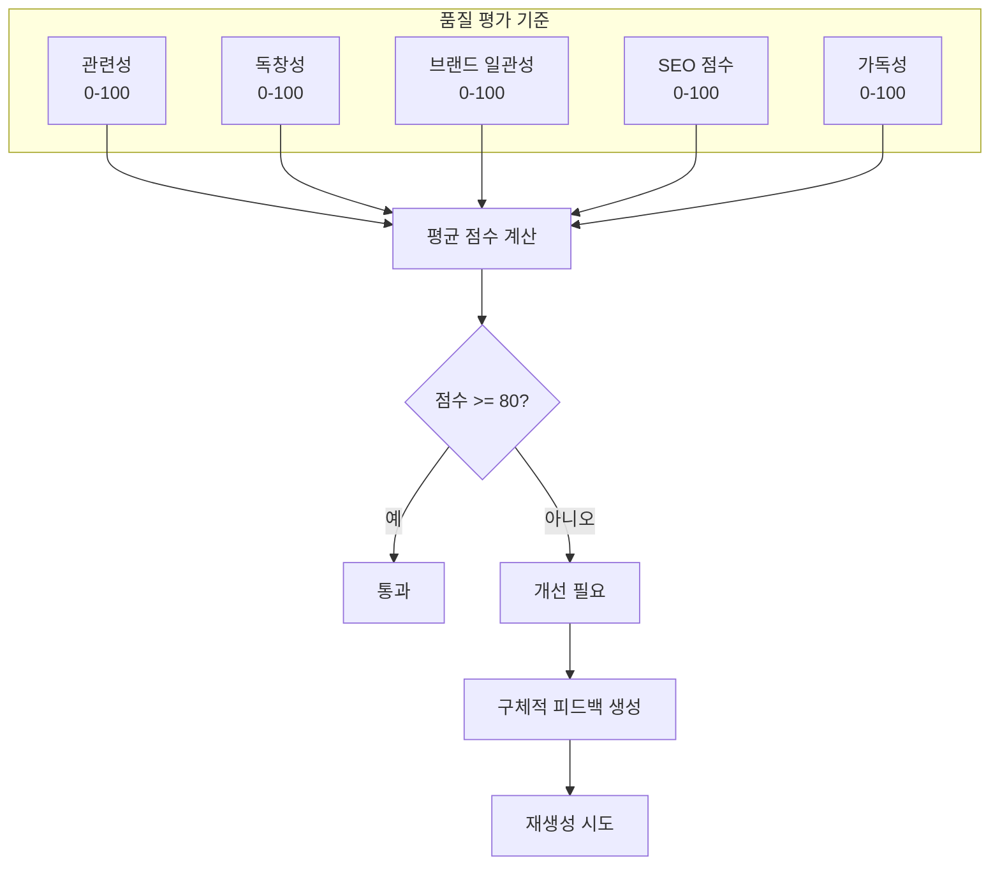
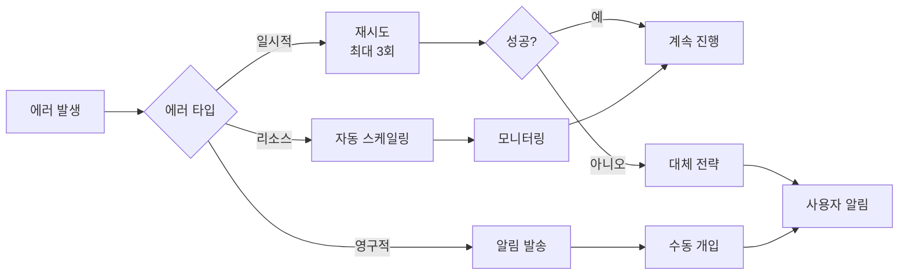

# 콘텐츠 생성 워크플로우

> 버전: 1.0.0  
> 작성일: 2025년 8월 4일  
> 문서 유형: 시스템 플로우 다이어그램

## 개요

이 문서는 Bespoke AI Suite의 콘텐츠 생성 워크플로우를 시각적으로 설명합니다. Crew AI 에이전트들이 어떻게 협업하여 고품질 콘텐츠를 생성하는지 단계별로 보여줍니다.

## 콘텐츠 생성 플로우차트



## 상세 프로세스 설명

### 1. 요청 수신 및 검증


### 2. Crew AI 에이전트 협업


### 3. 콘텐츠 타입별 생성 프로세스

#### 텍스트 콘텐츠 생성


#### 이미지 콘텐츠 생성


### 4. 품질 관리 프로세스



## 성능 지표

### 평균 처리 시간
- 텍스트 (500-1500 단어): 45-90초
- 이미지 (1024x1024): 30-60초
- 영상 (30초): 3-5분

### 품질 점수 분포
```
90-100점: 25% (즉시 승인)
80-89점:  45% (마이너 수정 후 승인)
70-79점:  20% (1-2회 재생성)
70점 미만: 10% (수동 개입 필요)
```

## 에러 처리 및 복구



## 모니터링 포인트

1. **요청 수신률**: API Gateway 메트릭
2. **큐 대기 시간**: Kafka 지연 시간
3. **에이전트 처리 시간**: 각 에이전트별 평균 소요 시간
4. **AI API 응답 시간**: Claude, Stable Diffusion 등
5. **품질 점수 분포**: 일별/주별 트렌드
6. **재시도율**: 품질 미달로 인한 재생성 비율

---

*이 워크플로우는 지속적으로 최적화되고 있으며, 실제 운영 데이터를 기반으로 개선됩니다.*