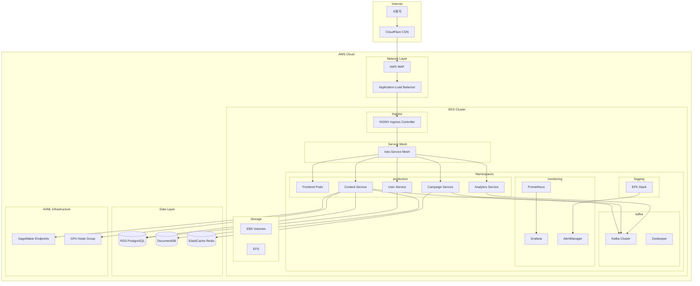
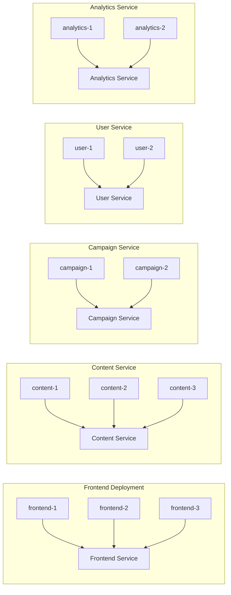
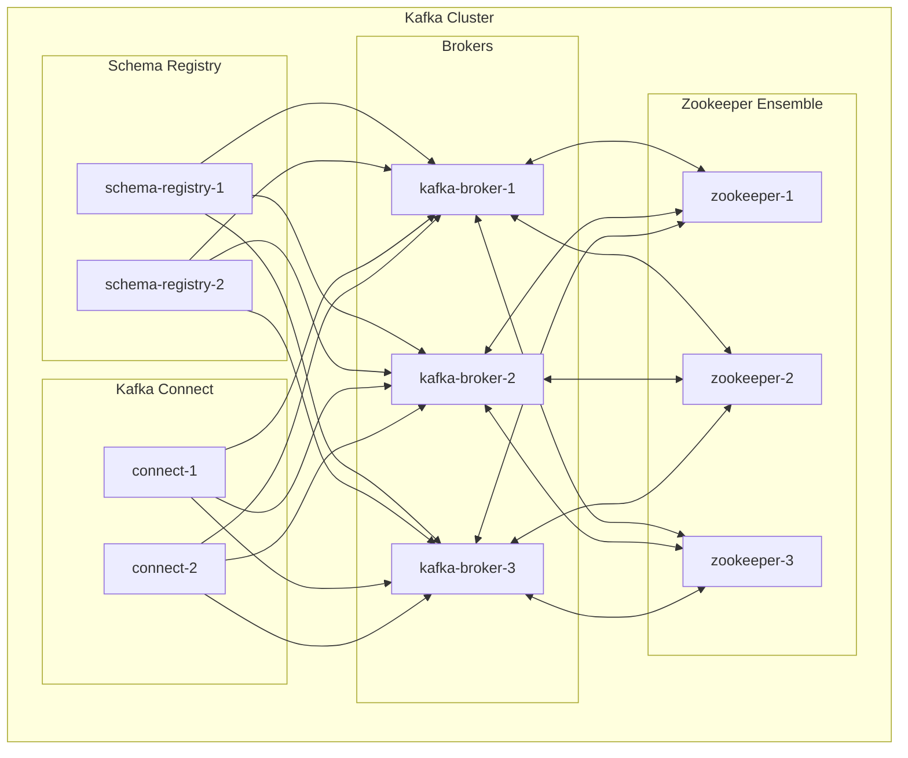
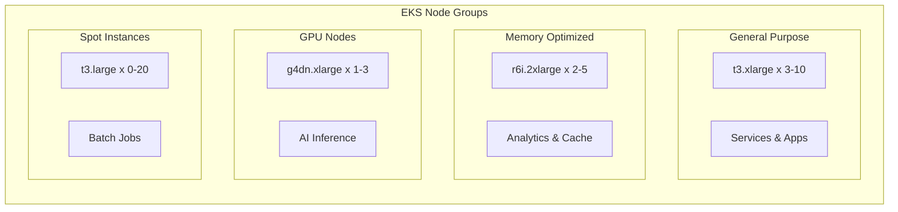
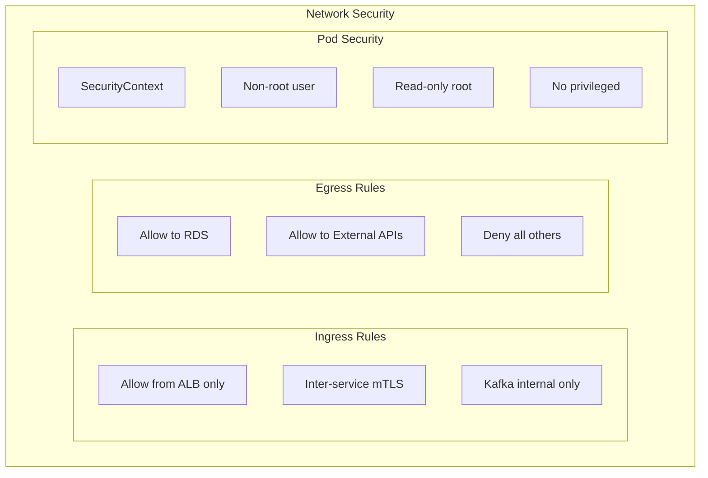
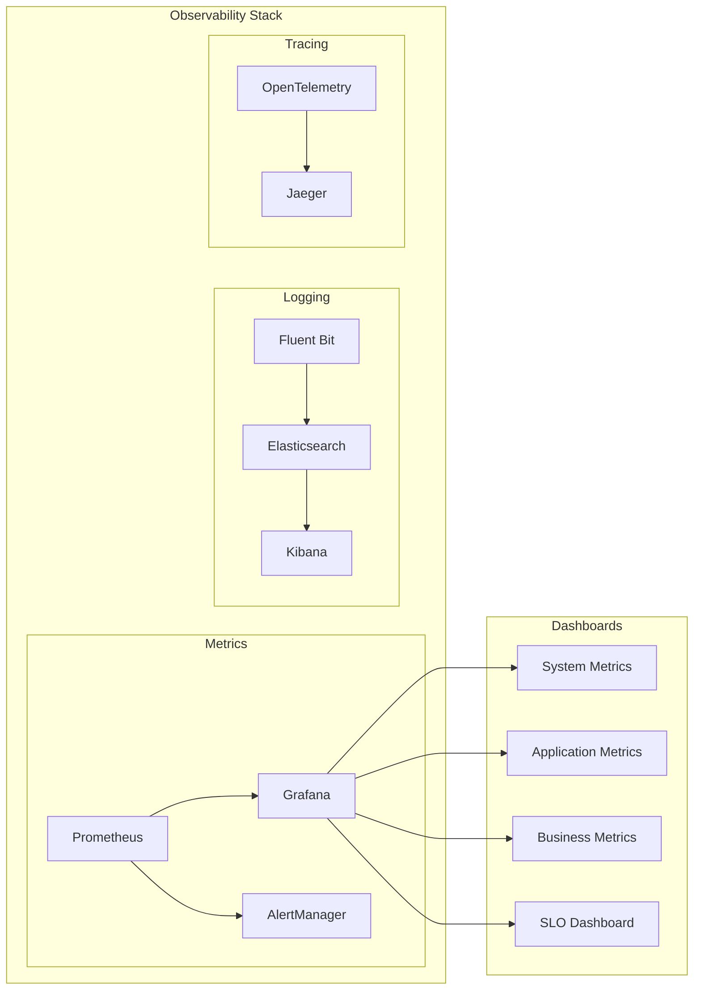
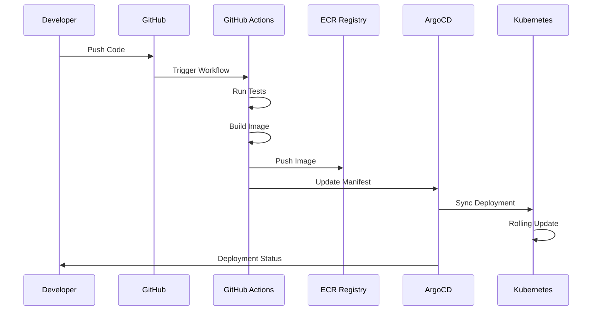
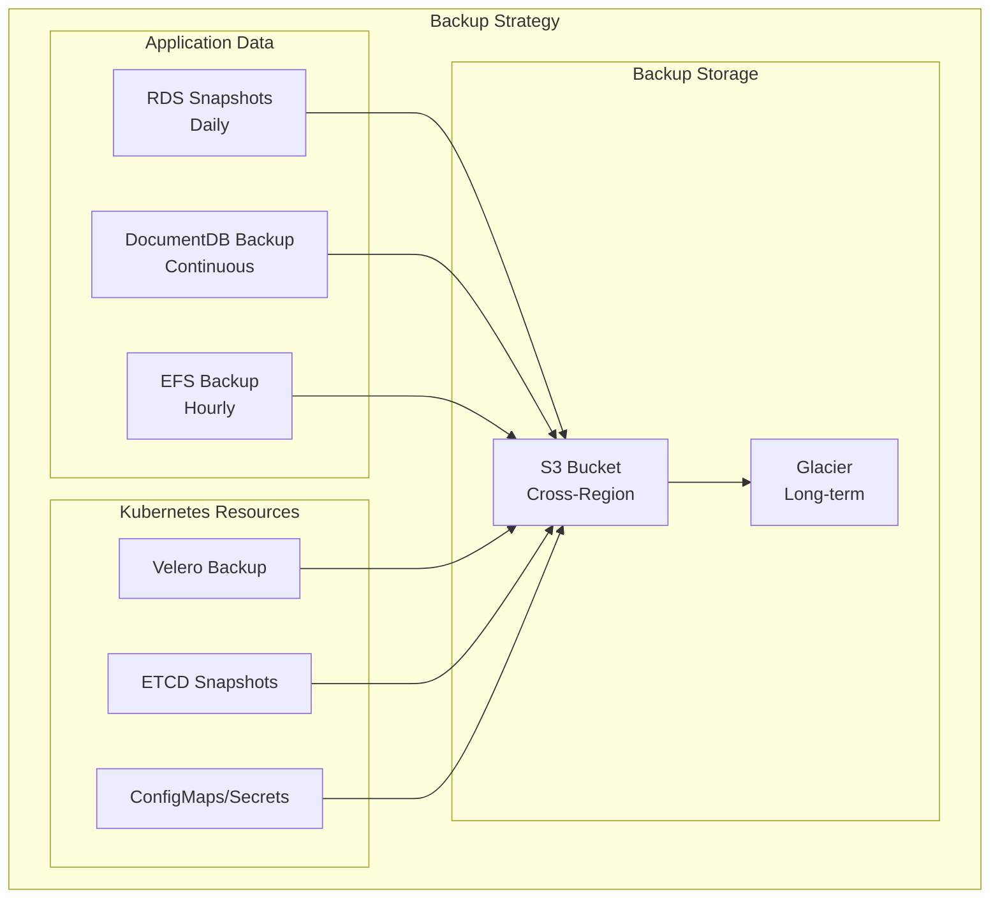
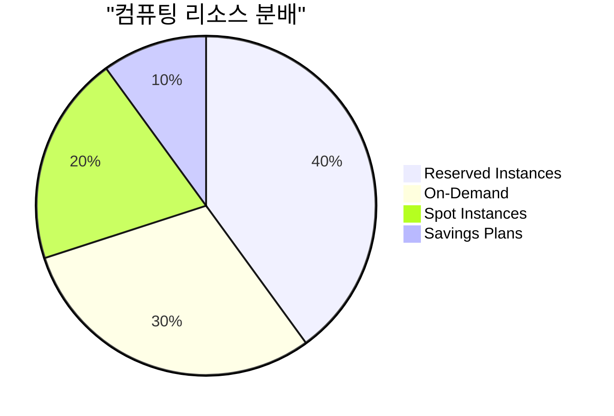

# Kubernetes 배포 아키텍처

> 버전: 1.0.0  
> 작성일: 2025년 8월 4일  
> 문서 유형: 인프라 배포 다이어그램

## 개요

이 문서는 Bespoke AI Suite의 Kubernetes 기반 프로덕션 배포 아키텍처를 설명합니다. 고가용성, 확장성, 보안을 고려한 엔터프라이즈급 배포 구조를 제시합니다.

## 전체 클러스터 구조



## 네임스페이스별 상세 구조

### Production Namespace



### Kafka Namespace



## 리소스 할당 및 오토스케일링

### Pod 리소스 사양

```yaml
# Content Service Pod
resources:
  requests:
    memory: "2Gi"
    cpu: "1000m"
  limits:
    memory: "4Gi"
    cpu: "2000m"

# HPA 설정
horizontalPodAutoscaler:
  minReplicas: 3
  maxReplicas: 20
  metrics:
    - type: Resource
      resource:
        name: cpu
        target:
          type: Utilization
          averageUtilization: 70
    - type: Resource
      resource:
        name: memory
        target:
          type: Utilization
          averageUtilization: 80
    - type: Pods
      pods:
        metric:
          name: kafka_consumer_lag
        target:
          type: AverageValue
          averageValue: "100"
```

### Node Groups



## 보안 구성

### Network Policies



### RBAC 구성

```yaml
# Service Account 예시
apiVersion: v1
kind: ServiceAccount
metadata:
  name: content-service
  namespace: production
  
---
apiVersion: rbac.authorization.k8s.io/v1
kind: Role
metadata:
  name: content-service-role
  namespace: production
rules:
  - apiGroups: [""]
    resources: ["configmaps", "secrets"]
    verbs: ["get", "list"]
  - apiGroups: [""]
    resources: ["pods"]
    verbs: ["get", "list", "watch"]
```

## 모니터링 및 로깅 스택



## CI/CD 파이프라인 통합



## 재해 복구 및 백업

### 백업 전략



### 복구 시나리오

1. **Pod 장애**: 자동 재시작 (30초 이내)
2. **Node 장애**: Pod 재스케줄링 (2분 이내)
3. **Zone 장애**: 다른 AZ로 자동 페일오버 (5분 이내)
4. **Region 장애**: DR Region 활성화 (30분 이내)

## 비용 최적화

### 리소스 활용 전략



### 예상 월간 비용 (USD)

| 컴포넌트 | 리소스 | 예상 비용 |
|---------|--------|----------|
| EKS Control Plane | 1 cluster | $72 |
| Worker Nodes | 10-30 nodes | $1,500-4,000 |
| Load Balancer | 2 ALB | $50 |
| RDS PostgreSQL | db.r6g.xlarge Multi-AZ | $600 |
| DocumentDB | 3 nodes | $800 |
| ElastiCache | cache.r6g.large | $200 |
| Data Transfer | 10TB/month | $900 |
| **총계** | | **$4,122-6,622** |

## 운영 체크리스트

- [ ] 모든 Pod에 리소스 제한 설정
- [ ] HPA/VPA 설정 및 테스트
- [ ] Network Policy 적용
- [ ] RBAC 최소 권한 원칙 적용
- [ ] 모니터링 대시보드 구성
- [ ] 알람 규칙 설정
- [ ] 백업 자동화 검증
- [ ] DR 시나리오 테스트
- [ ] 보안 스캔 자동화
- [ ] 비용 알림 설정

---

*이 배포 아키텍처는 프로덕션 환경의 요구사항에 따라 조정될 수 있습니다.*